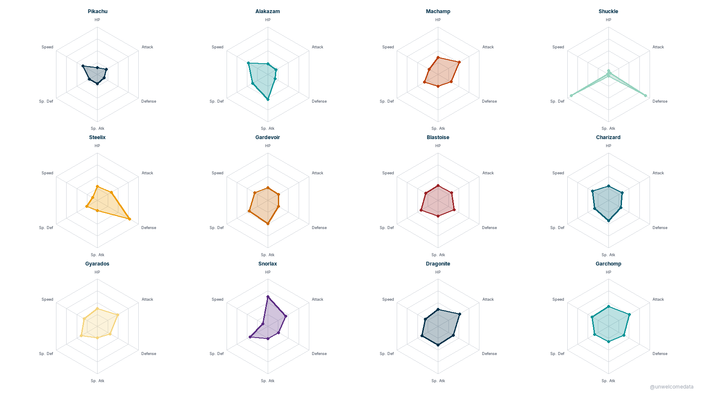
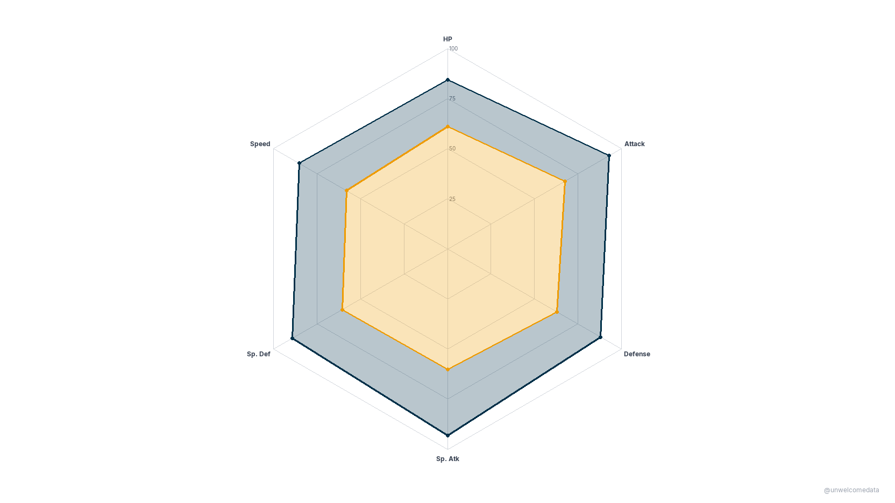
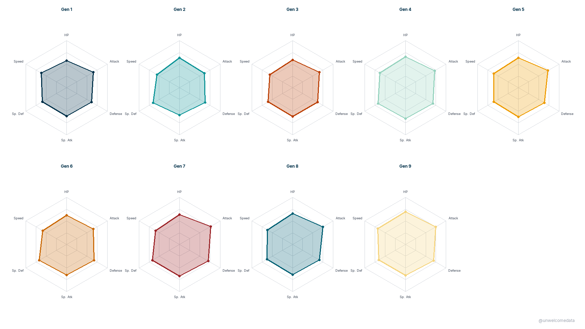
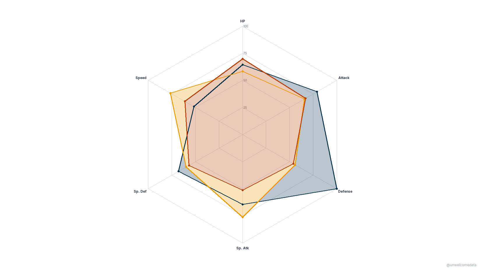

**[@unwelcomedata](https://github.com/unwelcomedata)** · data from public sources
Follow for new charts: [X](https://x.com/unwelcomedata) · [Bluesky](https://bsky.app/profile/unwelcomedata.bsky.social)

# Pokémon stat fingerprints

Every Pokémon is just six numbers — HP, Attack, Defense, Sp. Atk, Sp. Def, and
Speed. Plot those six on a radar and each one gets a **shape**: a stat
fingerprint. This looks at those fingerprints across **1,025 species** (all nine
generations, from [PokéAPI](https://pokeapi.co/)) — for iconic individuals, for
whole types, for each generation, and for legendaries versus everything else.

**The findings:**

- **Steel is the tank.** Of all 18 primary types, Steel has the highest average
  **Defense** (~111).
- **The games keep getting stronger.** Generation 9 species have the highest
  average base-stat total (**457.4 BST**) — power creep is real.
- **Legendaries are better at everything.** The legendary/mythical group averages
  **592 BST** versus **411** for the ordinary field — and they sit outside the
  field on *every one* of the six axes, not just one or two.
- There are **94** legendary/mythical species and **931** ordinary ("field")
  species in the set.

---

_Click any chart to open it at full resolution._

## 1. Iconic stat fingerprints

Twelve well-known Pokémon, each drawn as its own radar on the raw **0–255** stat
scale, so you can read the archetypes directly: Shuckle's enormous defensive
wall, Alakazam's glass-cannon spike, Blissey's wall of HP. These are individual
species, not averages.

## 2. Legendaries vs. the field

One radar overlaying the **average** legendary/mythical fingerprint against the
**average** of the ordinary field. The legendary shape fully contains the field
shape — legendaries are bigger on every axis.

> **Base forms only.** These averages use one canonical base form per species;
> Mega Evolutions, Gigantamax, regional variants, and alternate/Paradox forms are
> excluded. That's why this set's averages run slightly below form-inclusive fan
> wikis (e.g. legendary avg ~592 here vs ~626 on Bulbapedia). Scope difference,
> not an error — see [SOURCES.md](SOURCES.md).

## 3. Power creep by generation

One radar per generation (I–IX) showing each generation's **average** stats. The
shapes grow outward over time, with Generation 9 the largest — the newest
Pokémon are the strongest on average.

> **Base forms only** — averages exclude megas and alternate forms (see note
> above and [SOURCES.md](SOURCES.md)).

## 4. Three types, three shapes

One radar overlaying the **average** fingerprint of three contrasting types:
**Steel** (the defensive wall), **Electric** (fast and special-leaning), and
**Normal** (the balanced middle). Same six axes, three very different shapes.

> **Base forms only** — averages exclude megas and alternate forms (see note
> above and [SOURCES.md](SOURCES.md)).

---

## How it was measured

Each Pokémon's six base stats come straight from PokéAPI (the current/latest
game values). Chart 1 plots individual species on the raw 0–255 stat scale.
Charts 2–4 are **averages**, normalized so the typical shape fills the radar
frame — the comparison is between shapes, so the normalization is shared within
each chart and the rankings are unaffected.

The one honest limit worth repeating: everything here is **base forms only** —
one canonical form per species. Mega Evolutions, Gigantamax, regional variants,
and Paradox forms are left out, so these averages read a touch lower than
encyclopedias that fold those high-stat forms in. The direction of every finding
(Steel tankiest, Gen 9 strongest, legendaries above the field everywhere) holds
regardless.

## The data

The full per-species dataset is published here:

- **[pokemon_base_stats_v1.csv](export/pokemon_base_stats_v1.csv)** — 1,025
  species × 15 columns (id, name, generation, legendary/mythical flags, both
  types, the six base stats, and base-stat total).
- **[Codebook](export/pokemon_base_stats_v1_codebook.md)** — a plain-English
  description of every column.

## Sources & license

Full attribution and the methodology write-up are in
**[SOURCES.md](SOURCES.md)**.

Data is from **[PokéAPI](https://pokeapi.co/)** — a community-run, keyless public
REST API of Pokémon game data. Pokémon names, stats, and types are
© Nintendo / Game Freak / The Pokémon Company, used here nominatively
(fun-tier, non-commercial, attributed).

---

> **AI-Assisted Development**
> This project was built with the assistance of [Kiro](https://kiro.dev),
> an AI-powered development environment. All data sourcing decisions,
> methodology choices, and published findings are the responsibility of the
> author. AI was used for code generation, data pipeline construction, and
> research assistance — not for analysis conclusions or editorial judgment.
